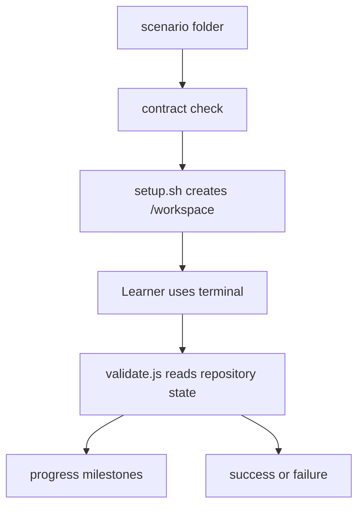

# Contributing

## Scope

Scenario additions are the preferred contribution. Keep the existing API, web, and Docker architecture unchanged unless a separate issue explicitly requests an architectural change.

## Add a scenario

1. Create `apps/api/scenarios/<category>/<scenario-id>/`.
2. Add `scenario.json`, `setup.sh`, and `validate.js`.
3. Use a unique kebab-case scenario ID and make the folder name match it.
4. Start from a clean `/workspace` in `setup.sh`; setup must be repeatable.
5. Make `validate.js` read repository state and return `success`, `progress`, and `message`; it should not modify the repository.
6. Define matching `whatToDo` IDs and `alex.situations` keys.
7. Keep the scenario folder self-contained and do not write generated state into `/scenarios`.
8. Run `npm run check:scenarios` and `npm run test:scenario-setups`.

Each scenario uses this flow:

The current repository contains one legacy duplicate metadata ID. The checker reports it as a warning and runtime uses that scenario's folder name to keep IDs unique. New scenarios must not add duplicates.

## Pull requests

- Explain the Git skill being taught.
- Include the commands needed to solve the scenario in the pull request description.
- Confirm setup, validator syntax, lint, and build checks pass when relevant.
- Keep unrelated formatting and dependency changes out of the pull request.

## Code changes

For changes outside scenarios, include a focused reason, a regression test or reproducible check, and the expected local commands. Do not commit `.env` files, credentials, build output, or `node_modules`. Do not modify scenario files as part of an unrelated infrastructure change.
