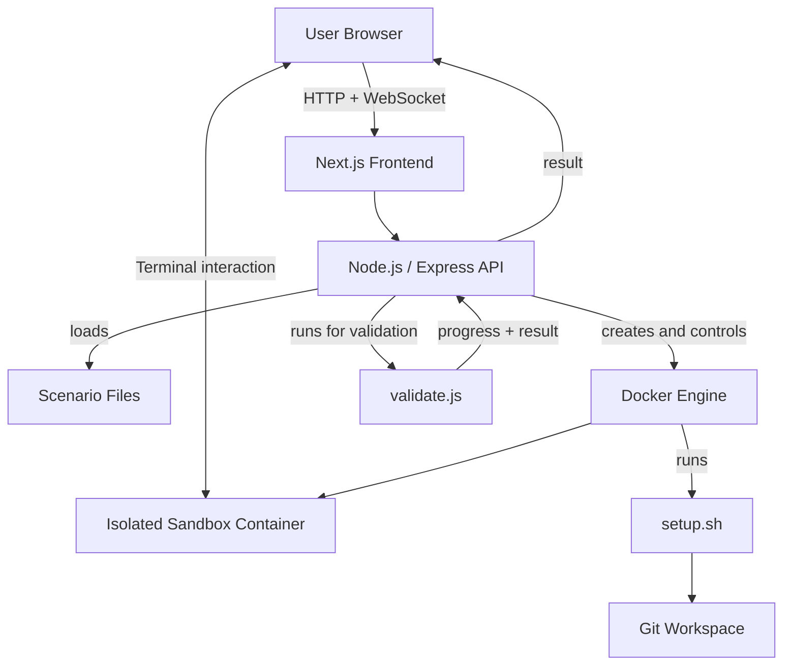

# Git Workflow Simulator

[](https://github.com/raahu1l/git-workflow-simulator/actions/workflows/ci.yml)
[](LICENSE)

An open-source Git practice platform where learners perform real Git workflows in isolated terminal environments.

**[🌐 Live Demo](YOUR_LIVE_DEMO_URL)** · **[📦 Repository](https://github.com/raahu1l/git-workflow-simulator)**

---

## Overview

Git Workflow Simulator helps learners build Git skills through hands-on practice instead of command memorization.

Learners choose a scenario, receive a prepared Git repository, work in a browser terminal, and validate the resulting repository state. Hints, objectives, and Alex reactions provide guidance during the exercise.

The frontend runs in the browser while the Node.js/Express API creates and controls Docker sandbox containers on the server. Learners using a hosted deployment do not need Docker installed locally.

---

## ✨ Features

- 🖥️ Browser-based terminal using xterm.js, WebSocket, and node-pty
- 🐳 Isolated Docker workspace for each session
- 📚 Scenario browsing by learning path and difficulty
- 💡 Objectives and hints during scenarios
- 🤖 Alex milestone and result reactions
- ✅ Repository-state validation instead of command matching
- 🔄 Real Git workflows using actual Git repositories
- 🧩 Self-contained scenario system for adding new exercises

---

## 📸 Screenshots

Add these screenshots after the hosted version is ready.

### 1. Home / Scenario Library

**Suggested file:** `docs/screenshots/home.png`

Show:
- Hero section
- Featured/recent scenarios
- Learning paths
- Main navigation

<!-- TODO: Add screenshot -->


### 2. Scenario Workspace / Browser Terminal

**Suggested file:** `docs/screenshots/scenario-workspace.png`

Show:
- Scenario title/objective
- What To Do section
- Browser terminal
- Hints/Alex panel if visible

<!-- TODO: Add screenshot -->


### 3. Successful Validation

**Suggested file:** `docs/screenshots/validation-success.png`

Show:
- Completed scenario
- Successful validation/result
- Alex success reaction if visible

<!-- TODO: Add screenshot -->


> Optional: Add `docs/screenshots/scenario-library.png` later if you want a dedicated screenshot of the scenario/category browsing experience.

---

## 🏗️ Architecture



The browser starts a session through the API. The API prepares an isolated Docker sandbox and runs the scenario setup. The learner then works in the browser terminal. When the solution is checked, `validate.js` evaluates the repository state and returns progress and the final result.

---

## 🧩 Scenario System

Every scenario is a self-contained folder with exactly three files:

| File | Responsibility |
| --- | --- |
| `scenario.json` | Metadata, objectives, hints, and Alex reactions |
| `setup.sh` | Creates the learner's initial repository and Git state |
| `validate.js` | Checks the resulting Git state and returns progress/result data |

---

## 📚 Learning Paths

The repository currently contains scenarios across:

- **Git Foundations**
- **Branching & Collaboration**
- **History & Recovery**
- **Advanced Git Workflows**

---

## 🛠️ Tech Stack

| Layer | Technologies |
| --- | --- |
| Frontend | Next.js, React, TypeScript, Tailwind CSS |
| Backend | Node.js, Express |
| Terminal | xterm.js, WebSocket, node-pty |
| Sandbox | Docker, Bash, Git |

---

## 🚀 Getting Started

### Prerequisites

- Node.js 20+
- npm
- Docker Desktop or Docker Engine

### Install

```bash
npm ci
docker build -t git-sandbox docker
```

Create the environment files:

**Windows PowerShell**

```powershell
Copy-Item apps\api\.env.example apps\api\.env
Copy-Item apps\web\.env.example apps\web\.env.local
```

**macOS / Linux**

```bash
cp apps/api/.env.example apps/api/.env
cp apps/web/.env.example apps/web/.env.local
```

### Run locally

Start the API:

```bash
npm run dev:api
```

Start the web application in a separate terminal:

```bash
npm run dev:web
```

Then open:

```text
http://localhost:3000
```

The API needs permission to communicate with Docker. See the environment example files for the available configuration.

---

## 🧪 Testing

Run the project's available checks:

```bash
npm run check:scenarios
npm run test:scenario-setups
npm run check:syntax --workspace @git-workflow-simulator/api
npm run lint:web
npm run build:web
```

### What the checks cover

- `check:scenarios` — checks required scenario files, metadata, IDs, and `validate.js` syntax.
- `test:scenario-setups` — runs every `setup.sh` in a disposable Docker container.
- `check:syntax` — checks API JavaScript syntax.
- `lint:web` — runs frontend linting.
- `build:web` — verifies the production frontend build.

---

## 🌐 Deployment

A hosted deployment follows this model:

```text
User Browser
     ↓
Hosted Frontend
     ↓
Hosted Backend
     ↓
Docker Engine
     ↓
Isolated Scenario Containers
```

The backend requires Docker on the server to create isolated scenario environments. Learners do not need Docker when using a hosted deployment.

Configure:

```text
CORS_ORIGIN
NEXT_PUBLIC_API_URL
NEXT_PUBLIC_WS_URL
```

Use HTTPS and a reverse proxy that supports WebSocket upgrades.

> **Current limitation:** Sessions are stored in memory and are lost when the API restarts.

> **Security:** Do not expose the Docker socket or the backend API directly to the public internet. See [SECURITY.md](SECURITY.md) for deployment security considerations.

---

## 🤝 Contributing

Contributions are welcome.

See [CONTRIBUTING.md](CONTRIBUTING.md) for local development, scenario creation, testing, and pull request guidelines.

---

## 🔐 Security

For security vulnerabilities and responsible disclosure instructions, see [SECURITY.md](SECURITY.md).

---

## 📄 License

This project is licensed under the MIT License. See [LICENSE](LICENSE) for the full license text.

---

## 🔗 Links

- 🌐 **Live Demo:** [YOUR_LIVE_DEMO_URL](YOUR_LIVE_DEMO_URL)
- 🐛 **Issues:** [GitHub Issues](https://github.com/raahu1l/git-workflow-simulator/issues)
