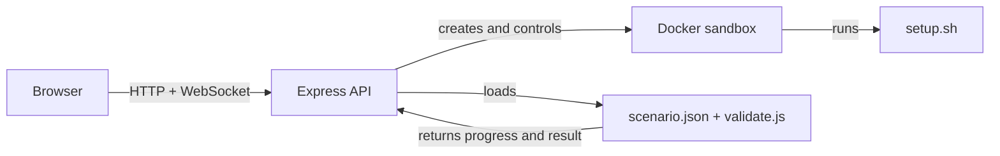

# Git Workflow Simulator

Git Workflow Simulator is an open-source practice environment for learning Git through realistic terminal scenarios. Each scenario runs in its own Docker sandbox and is validated by repository state, not by matching typed commands.

Source: [github.com/raahu1l/git-workflow-simulator](https://github.com/raahu1l/git-workflow-simulator)

Live app: add the deployed URL here after publishing.

## How it works



The browser starts a session, the API prepares an isolated container, and the learner works in the container terminal. `validate.js` checks the repository state and returns progress milestones and a final result.

## Requirements

- Node.js 20 or newer
- npm
- Docker Desktop or Docker Engine
- Internet access during the Docker image build and scenario setup scripts

## Run locally

```powershell
npm install
docker build -t git-sandbox docker
Copy-Item apps\api\.env.example apps\api\.env
Copy-Item apps\web\.env.example apps\web\.env.local
```

Start each service in its own terminal:

Terminal 1:

```powershell
npm run dev:api
```

Terminal 2:

```powershell
npm run dev:web
```

Open `http://localhost:3000`.

On macOS/Linux, use `cp` instead of `Copy-Item` and run the same npm commands.

The API must be able to run Docker commands. The Docker image must be named `git-sandbox`, unless `DOCKER_IMAGE` is changed in `apps/api/.env`.

## Configuration

API settings are documented in [apps/api/.env.example](apps/api/.env.example):

- `PORT`, `HOST`: API bind address.
- `CORS_ORIGIN`: allowed browser origin. Set this to the deployed web URL; do not leave the permissive default in a public deployment.
- `DOCKER_IMAGE`: sandbox image name.
- `SESSION_TTL_MS`: session lifetime in milliseconds.
- `MAX_WEBSOCKET_MESSAGE_BYTES`: maximum terminal WebSocket message size.

Web settings are documented in [apps/web/.env.example](apps/web/.env.example):

- `NEXT_PUBLIC_API_URL`: public API base URL, without a trailing slash.
- `NEXT_PUBLIC_WS_URL`: public WebSocket URL, without a trailing slash.

The session access token is passed in the session URL and used for later API and WebSocket requests. Treat session URLs as private until the session expires.

## Checks

```bash
npm run check:scenarios
npm run test:scenario-setups
npm run check:syntax --workspace @git-workflow-simulator/api
npm run lint:web
npm run build:web
```

`npm run check:scenarios` checks metadata, required files, and validator syntax. `npm run test:scenario-setups` runs every `setup.sh` in a disposable Docker container. The setup test requires the local `git-sandbox` image.

## Architecture

- `apps/api`: Express API, Docker sandbox lifecycle, WebSocket terminal, and scenario validation.
- `apps/web`: Next.js interface, scenario library, terminal, and progress reactions.
- `docker`: reusable sandbox image.
- `scripts`: repository checks used locally and in CI.

The API keeps sessions in memory. This is suitable for a single-process deployment or local learning, but sessions are lost when the API restarts. Use a reverse proxy that supports WebSocket upgrades and keep Docker access restricted to the API host.

## Deploy on a VM

1. Install Node.js 20+, npm, Git, and Docker on the VM.
2. Clone the repository and run `npm ci`.
3. Build the sandbox image with `docker build -t git-sandbox docker`.
4. Configure `apps/api/.env` with the public web origin and `apps/web/.env.local` with the public API and WebSocket URLs.
5. Run the API with `npm run start --workspace @git-workflow-simulator/api`.
6. Build the web app with `npm run build:web`, then run it with `npm run start --workspace web`.
7. Put HTTPS and WebSocket-aware reverse proxying in front of the web and API services.

The API process needs permission to communicate with Docker. Do not expose the Docker socket or API directly to the public internet. Use a firewall, HTTPS, a restricted `CORS_ORIGIN`, and an authentication layer before using a public deployment with untrusted users.

## Contributions

Scenario authoring and contribution instructions are in [CONTRIBUTING.md](CONTRIBUTING.md). Security issues should follow [SECURITY.md](SECURITY.md).

## License

MIT. See [LICENSE](LICENSE).
